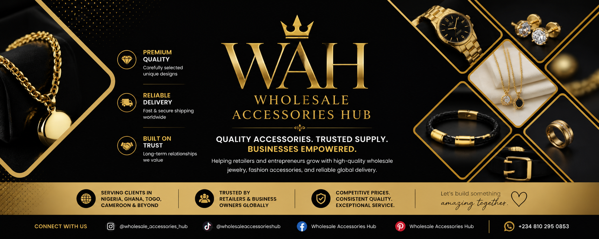

  

<h1 align="center">Wholesale Accessories Hub</h1>

  A modern wholesale platform designed to help retailers source quality accessories and grow their businesses globally.

# Wholesale Accessories Hub

A responsive multi-page wholesale website built with HTML, CSS, and JavaScript, designed to help retailers and entrepreneurs easily source high-quality accessories and grow their businesses.

Deployed on Netlify with integrated form handling and scalable architecture for future expansion.

---

## 📁 Project Structure

wholesale-accessories-hub/
│
├── index.html        (Homepage)
├── about.html        (Business Story & Mission)
├── team.html         (Founder & Team)
├── contact.html      (Contact Page)
├── thank-you.html    (Form Confirmation Page)
├── style.css
├── script.js
└── images/

---

## 🏠 Homepage

- Hero section with image slider  
- Brand introduction and value proposition  
- Services overview (Wholesale, Shipping, Partnerships)  
- Instagram-style testimonials  
- Call-to-action sections  
- Social media integration  

---

## 📖 About Page

- Business origin story (from university startup to global supplier)  
- Growth journey and milestones  
- Mission and vision  
- “Why Choose Us” section  
- Contact call-to-action  
- Business contact information  

---

## 👩‍💼 Founder & Team Page

- Founder story and professional background  
- Education and tech experience  
- Responsive image-text layout  
- Team section (brand support and operations)  
- Visual banner section  
- Business collaboration CTA  

---

## 📩 Contact Page

- Netlify-powered contact form  
- Custom JavaScript validation  
- International phone input (intl-tel-input)  
- Preferred contact method selection  
- WhatsApp integration  
- Redirect to custom thank-you page  

---

## 🙏 Thank You Page

- Custom confirmation page  
- WhatsApp call-to-action  
- Dynamic phone number handling using localStorage  

---

## 🚀 Features

- Fully responsive design (mobile-first)  
- Multi-page scalable structure  
- Netlify Forms integration (no backend required)  
- WhatsApp dynamic linking  
- Scroll animations and reveal effects  
- Modern testimonial UI (Instagram-style)  
- Clean branding (gold, black, white theme)  

---

## 🌍 Deployment

Hosted on **Netlify** with GitHub integration for continuous deployment.

---

## 📌 Future Improvements

- Product catalogue pages with filtering  
- Backend/database integration  
- AI-powered recommendations  
- Customer dashboard for retailers  
- Blog/content marketing section  
- Google Reviews integration  
- Performance and SEO optimization  

---

## 🛠 Tech Stack

- HTML5  
- CSS3  
- JavaScript  
- Netlify (Hosting & Forms)  

---

## 📌 Project Vision

To evolve into a full digital wholesale platform that not only supplies products but also empowers entrepreneurs with tools, insights, and technology to scale globally.

---

## 🤝 Contribution

This project is currently maintained and developed as part of a growing digital platform. Contributions and ideas are welcome.

---

## 📬 Contact

For business inquiries or collaborations:

- Email: rubya4dables@gmail.com
